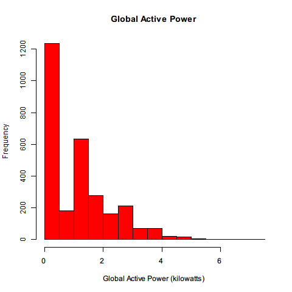
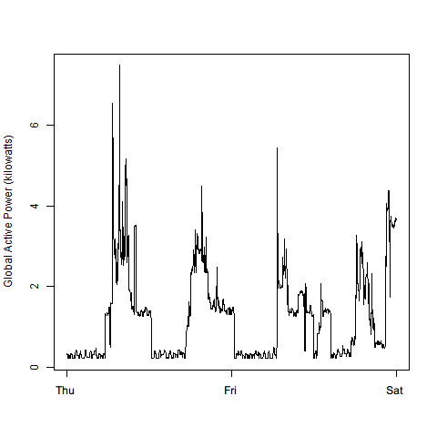
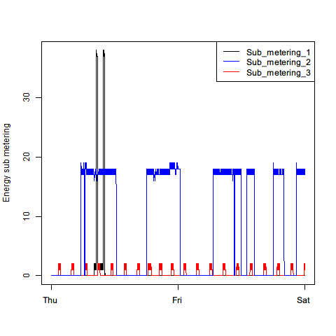
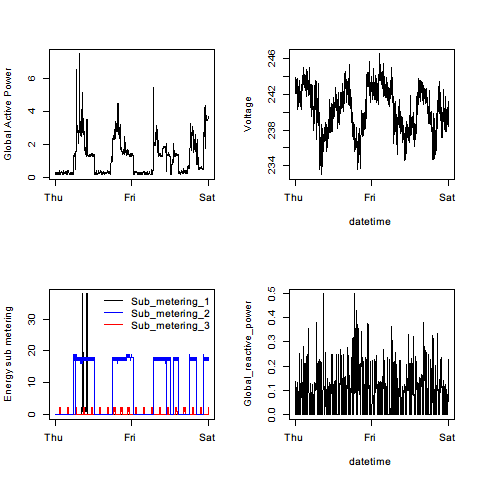

# Exploratory Data Analysis Course Project 1

## Usage

This assignment uses 5 scripts to generate the required plots.  To generate a plot, load and run the appropriate script (e.g. `plot1.R`) into your R environment.  Each script calls `getdata.R` to dowload, extract, subset, and load into memory the required data.  If the data has already been downloaded and extracted the script will automatically skip these steps.

<b>Note:</b> The included scripts do not properly deal with NA values.  This is because the `sqldf()` function used to import the raw data does not recognize the `?` character used in the data set.  This is not a problem for the plots being generated here because the subsetted data does not include any NAs.  However, if other date ranges are used this may cause problems and additional preprocessing of the raw data will be required to change `?` to something like -999 which can subsequently by converted to NA after loading the data into R.  

## Requirements

`getdata.R` relies on the `sqldf` library.  An Internet connection is required to download the data.  Each script should be edited so that the correct local working directory is defined.

## Output

Below are the plots created by the scripts along with the original reference images from the assignment they are based on.

### Plot 1

### Plot 1 (original reference image)

 

### Plot 2

### Plot 2 (original reference image)

 

### Plot 3

### Plot 3 (original reference image)

 

### Plot 4

### Plot 4 (original reference image)

 

